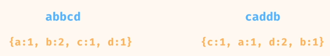
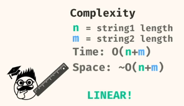

Typically hashing problems have a brute force solution with an $O(n^2)$ complexity. And by using a Hash data structure we can bring it down to $O(n)$ complexity.

Implementation:
- Python: Dictionary
- Java: Unordered Map
- Javascript: Object

A hashmap data structure is always unordered.





### Python Implementation

```python

```

Easier implementation

```python
from collections import Counter

print(Counter("catss"))
# returns {'s': 2, 'c': 1, 'a': 1, 't': 1}

def anagrams(s1, s2):
    return Counter(s1) == Counter(s2)
```

Java collections like HashMap only accept objects — not primitive types.